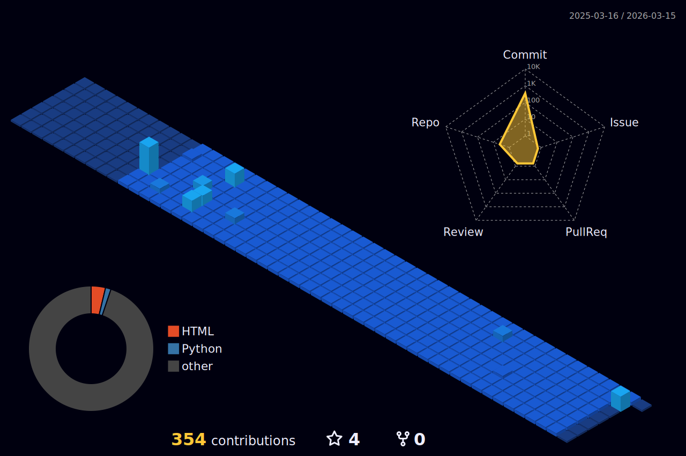

#  🧑🏻‍💻 ```      Hello World!      ``` :earth_americas: 
   *Sou estudante de Engenharia de Software pela Wyden*
<div align="left">
  <a href="https://www.instagram.com/neroengine_/" target="_blank">
    
  </a> 
  <a href="https://www.linkedin.com/in/hyoran-c-760604364/" target="_blank">
    
  </a>
  <a href="mailto:itshyoranofc@gmail.com" target="_blank">
    
  </a>
  <span style="display: flex; align-items: right; margin-left: 120px;"> <!-- Aumentado para 120px -->
    <span style="font-size: 8px; margin-right: 5px;"> :mag_right: </span>
    
  </span>
</div>

###  🔸```Tecnologias```:notebook_with_decorative_cover:
| 🔸 **HTML**  | :small_orange_diamond: **CSS**  | 🔸 **JavaScript**  |🔸 **TypeScript**   |  🔸 **Csharp**   |  🔸 **Java**   |
|:----- |:----- |:----- |:----- |:----- | :------ |

### 🔸```Estatísticas```:bar_chart:

  

<div style="display: flex; justify-content: space-between; width: 100%; align-items:center;">
  
  
  
</div>


